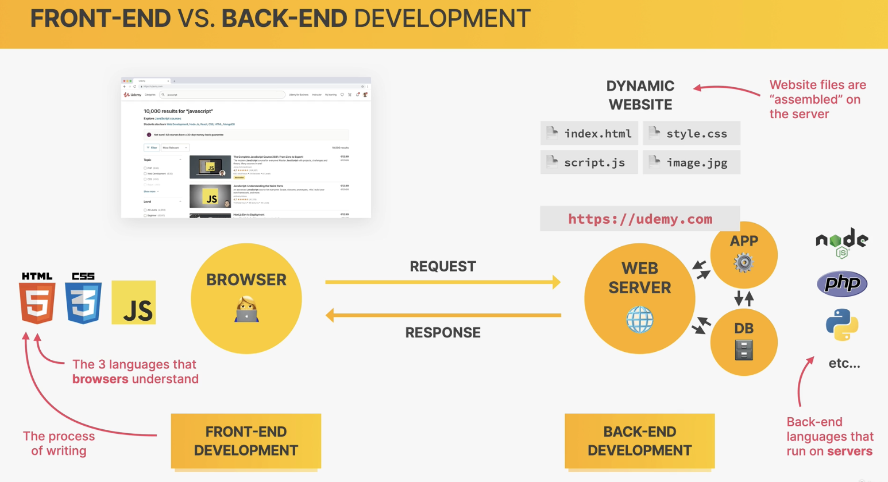
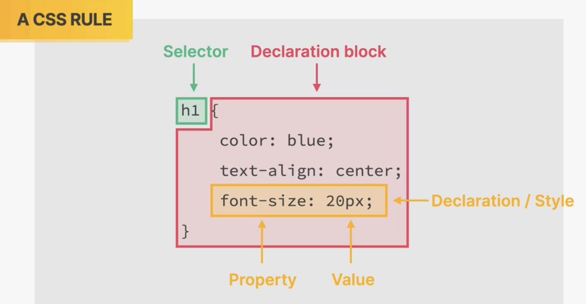
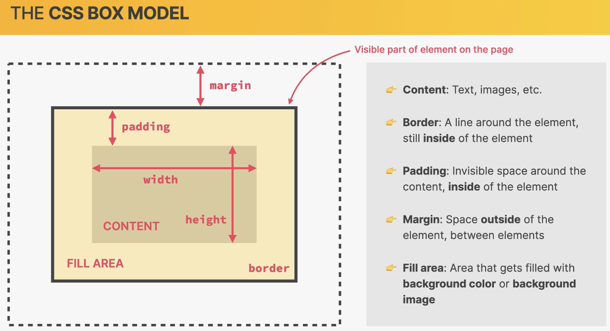
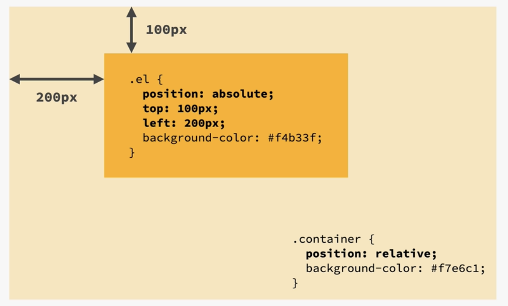
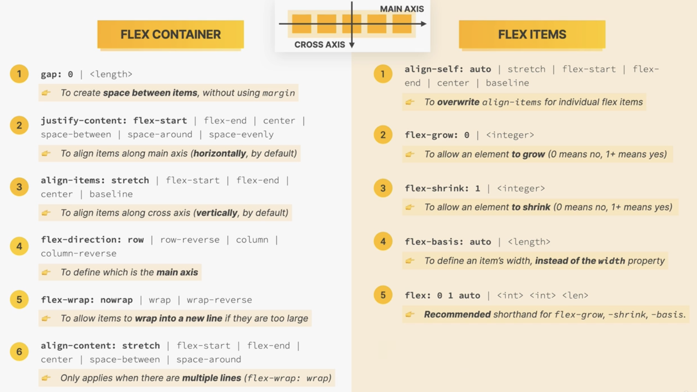
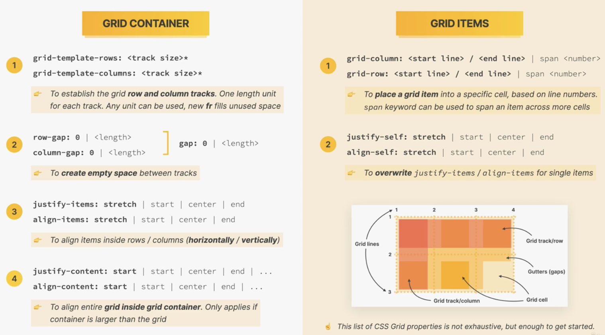
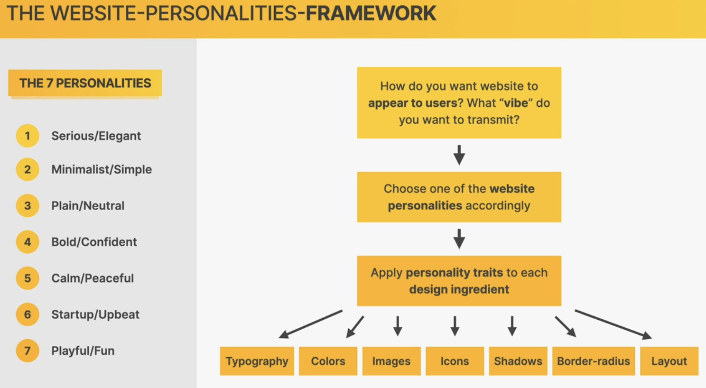
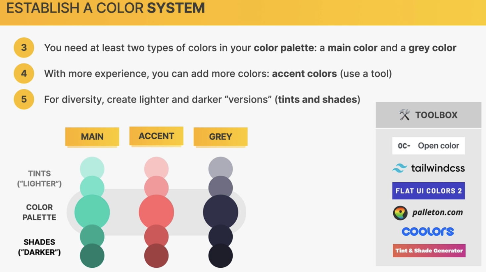

# Overview


- HTML: for content
- CSS: for presentation
- Javascript: dynamic, interactive effects; integration with backends

# HTML fundamentals

> Hyper Text Markup Language, used to
> - structure and describe the content of a webpage
> - define elements that describe different types of content: paragraphs, links, headings, images, videos, ...
> Web browsers understand HTML and can render webpage

## Structuring our Page

- Navigation links: `<nav> link groups </nav>`
- Header: grouping top-page `<header> ... </header>` 
- Article: grouping the content of a blog post `<article> ... </article>`
- Article can have header too
- Footer at the bottom of the page `<footer>`

## Semantic HTML
> Tags with some meaning for the elements


- `<strong>`: strong content
- `<em>`: emphasis
- `<header>, <footer>, <article>` are for some meaning

# CSS fundamentals

> Cascading Style Sheets
> - describe the visual style and presentation of the content written in HTML
> - consist of many properties



## Inline CSS
> Do NOT us this!

```html
<h1 style="color: blue">This is a blue heading</h1>
```

## Style elements
> Not quite often used neither


```html
<head>
    <style>
        h1 {
            color: blue;
        }
    </style>
</head>
<body>
    <h1>All Heading H1 are blue</h1>
</body>
```

## CSS files
`style.css`:
```css
h1 {
    color: blue;
}
```
`HTML file`:
```html
<head>
    <link href="style.css" rel="stylesheet" />
</head>
<body>
    <h1>All Heading H1 are blue</h1>
</body>
```

## Text properties

- color
- font-size, font-family, font-style, ...
- text-transform, ...

## Class and ID selectors

> We can style elements with selectors on **id** and **class** attributes

```html
<p id="a-para">Font 14 px</p>
<p class="a-class">Font 16 px</p>
```
`style sheet`
```css
#a-para {
    font-size: 14px;
}

.a-class {
    font-size: 16px;
}
```

!!! Note: to keep project easy to change in the future, avoid using id selectors. Better to use class selector even for 1 single element.

## Colors

> rgb (red, green, blue) model, shorthand as #hexhexhex
> and rgba (red, green, blue, alpha)

```css
color: #ffffff;
background: rgba(10, 20, 20, 0.5);
```
## Pseudo-classes

```css
li:first-child {
    font-weight: bold;
}

li:last-child {
    font-style: italic;
}

li:nth-child(even) {
    color: blue;
}
```

## Conflicts between selectors

`html`
```html
<p id="author" class="author">Author</p>
```
`css`
```css
#author {
    font-size: 18px;
    font-style: italic;
}

p {
    font-size: 22px;
}

.author {
    font-size: 20px;
}
```

Priority resolving in the following order:

- (5) Declarations marked important (`!`)
- (4) Inline style (`style="..."`) attribute in HTML tag 
- (3) ID (`#author`) selector 
- (2) Class (`.author`) selector 
- (1) Element (`p`) selector 
- (0) Universal (`*`) selector.


## Inheritance

## CSS box model

- Each element displayed on webpage can be seen as a rectangle box
- **content**: text, image, ... having width, height for the content area
- **border**: line around the element, but still **inside** the element
- **padding**: invisible space around the content, **inside** the element
- **margin**: space outside of the element, between elements
- **fill area**: filled with background color, or background image

> - element width: left border + left padding + width + right padding + right border
> - element height: top border + top padding + height + bottom padding + bottom border
> - the margins between elements can overlap, taking the largest value of the margins for spacing between them.



## Types of Boxes

- Block-level elements
  - occupy the entire width of the parent element
  - stacked vertically by default
- Inline elements
  - occupy only the space necessary for its contents
  - cause no linebreaks after or before the element
  - height and width do not apply
  - paddings and margins are applied only horizontally
- inline-block elements
  - seen from outside as inline elements: occupy only the space for content and do not make line-breaks
  - apply as block element inside.


## Absolute positioning

> the absolute positioned element is set at the provided position in the first (closest) parent container that is set to "relatvie" position.



## Pseudo element

```css
.product::before {
    ...
}
```

# Layouts: Floats, Flexbox, CSS grid

> 3 ways of building layouts

1. Float Layout
2. Flexbox
3. CSS grid

## Float layouts

## Flexbox

- flexbox is a set of CSS properties to build **1-dimensional layouts**.
- principle: **empty space inside a container element can be automatically divided by its child elements**.



## CSS Grid



# Web design Rules & Frameworks



## Typography

> Make texts beautiful and easy to read

## Colors



- use main color to draw attention to the most important elements (e.g. buttons)
- use colors to add interesting accents or make entire components or sections stand out


# Components and Layout Patterns

> Elements -> Components -> Layouts -> Pages

## Elements
- Texts
- Buttons
- Images
- Input elements: drop-down, input texts, radio, ...
- Tags

## Components

- Breadcrumbs: A > B > C ...
- Pagination
- Alert and status bars
- Statistics
- Galeries
- Feature boxes
- Preview and Profile cards
- 
