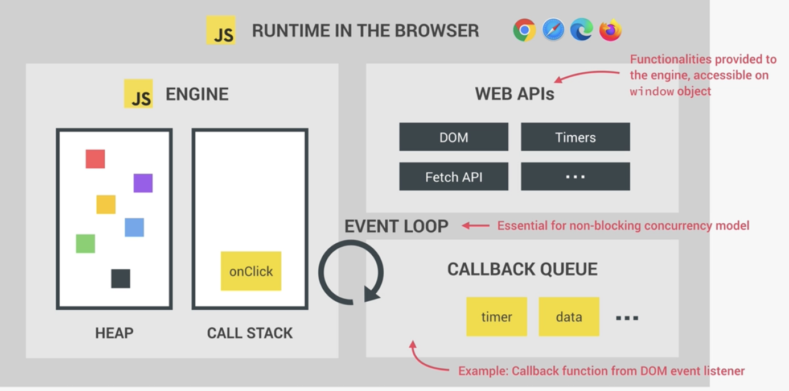
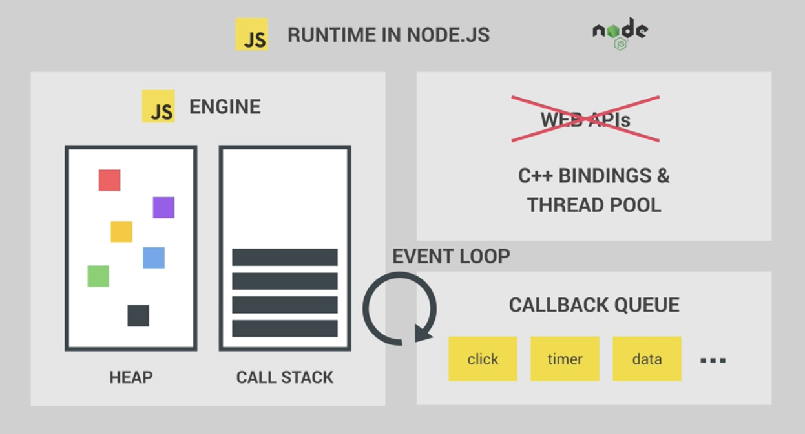
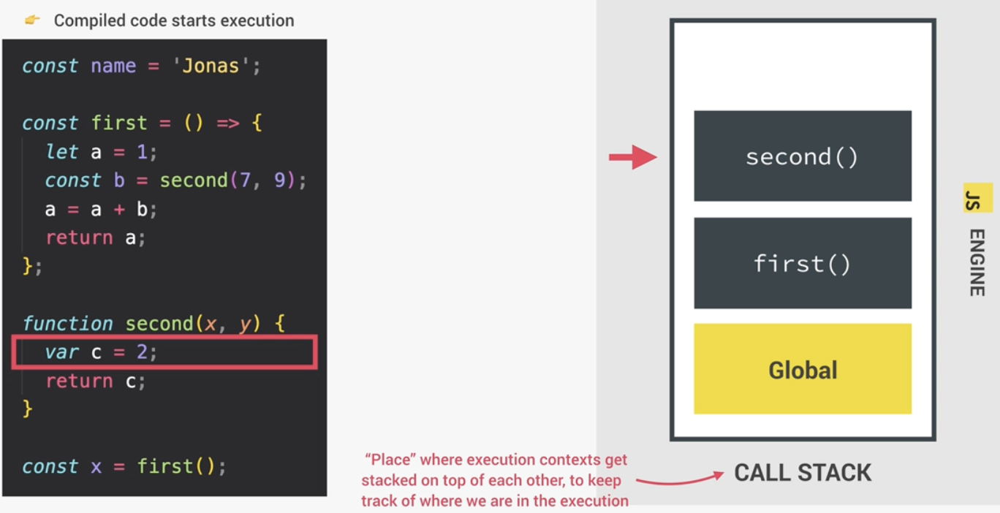
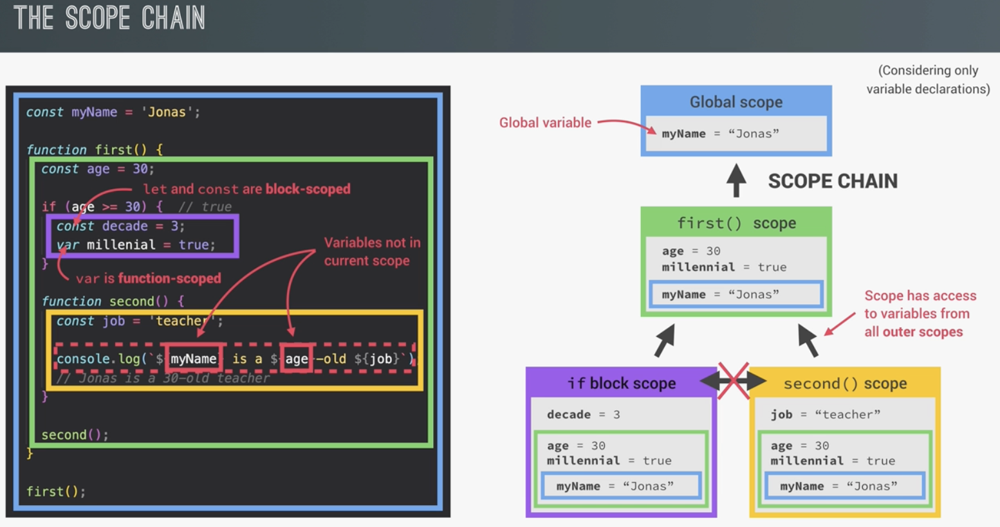

# JS Fundamentals

> Javascript is a
> - high-level (no low-level stuffs like memory management, ...),
> - object-oriented (based on objects),
> - multi-paradigm (imperative, declarative, ...)
> programming language

## Browser's Js console

```javascript
> alert("Hello Js")
> let js = 'amazing'
> if (js === 'amazing') alert("Hello Js")
```

## Role of JS in web development

3 core elements of Web development
- **HTML**: content of the web page
- **CSS**: presentation: styles, ... of the web page
- **Javascript**: programming language to add dynamic, interactive aspects to a web page


## JS data types

> JS is a dynamic typing language.
> all values are either an object or a primitive data

- number: floating point number
- string: sequence of characters
- boolean: logical type that can be only true or false
- undefined: value taken by a variable that is not defined yet: ```let something;```
- null: also for "empty value"
- symbol (only ES2015)
- bigint (from ES2020): for larger numbers that number type cannot hold

## let, const and var

```javascript
let age = 30;
age = 31; // OK
let count; // OK
count = 0;

const CS = 1990;
CS = 1991; // Error

const Job; // Error as const needs to be initialized
```

> var is the old way of defining variables
> - let is block-scoped
> - var is function-scoped
>
> should avoid using var

!!! Attention: if you declare a name without let/const/var, it will be an attribute in the global scope

```javascript
firstName = 'John'; // firstName is an attribute in the global scope
console.log(firstName);
```

## Operators

### strings

```js
const lastName = 'Smith';
const firstName = 'John';
const fullName = lastName + ' ' + firstName;
console.log(fullName);
```

### template literals

```js
const firstName = 'John';
const birthYear = 2000;
const currentYear = 2026;
const job = 'software engineer';
const phrase = `I'm ${firstName}, a ${currentYear - birthYear}-year old ${job}`;
console.log(phrase);
```

## Type conversion and Coercion

```js
const inputYear = '1990';
console.log(inputYear + 10); // -> '199010' as string concat: this is coercion
console.log(Number(inputYear) + 10); // -> 2000
```

more complex

```js
let n = '1' + 1; // '11'
n = n - 1; // -> 11 - 1 = 10
console.log(n);
```

## Falsy values

5 falsy values: 0, '', undefined, null, NaN

## equality: == vs ===

```js
console.log('18' == 18); // -> true (with coercion)
console.log('18' === 18); // -> false (no coercion)
```

## Conditional operator

```js
const drink = age >= 18 ? 'wine' : 'water';
```

## Strict Mode

```js
'use strict'; // at the beginning of the js file

let hasDriverLicense = false;
const passTests = true;

if (passTests) hasDriverLicenses = true; // throws an error "hasDriverLicenses is not defined"
if (hasDriverLicense) console.log('Can drive!');
```

## Functions: declaration and expression

```js
function fruitProcessor(apples, oranges) {
    console.log(apples, oranges);

    const juice = `Juice with ${apples} apples and ${oranges} oranges`;
    return juice;
}

const fruitJuice = fruitProcessor(5, 1);
console.log(fruitJuice);
```

> Function can be a value (expression), that we can store in a variable

```js
const calcAge = function (birthYear) {
    return 2026 - birthYear;
}

const age = calcAge(2000);
console.log(age);
```

## Arrow function

```js
const calcAge = birthYear => 2026 - birthYear;

const age = calcAge(2000);
console.log(age);
```

## Arrays

```js
const friends = ['Mike', 'John', 'Peter'];
console.log(friends);

const years = new Array(1991, 1984, 2000);

years[2] = 2001; // non-primitive type is not immutable even with const keyword, only that years cannot be assigned to another value
console.log(years);
```

## Objects

```js
const john = {
    firstName: 'John',
    lastName: 'Smith',
    birthYear: 1991,
    job: 'teacher',
    friends: ['Peter', 'Steven', 'Michael']
}

console.log(john);

console.log(john.firstName);
```

> if the key is dynamically computed/input, we needs to use the bracket operator

```js
const nameKey = 'Name';
console.log(john['first' + nameKey]);
console.log(john['last' + nameKey]);
```

## Object methods

```js
const john = {
    firstName: 'John',
    birthYear: 1991,
    // method
    calcAge: (birthYear) => {
        return 2026 - birthYear;
    } 

    // Arrow function cannot be used here to refer to this
    myAge: function() {
        return this.calcAge(this.birthYear);
    }
}

console.log(john.calcAge(john.birthYear));
console.log(john.myAge());
```

## Looping

```js
// java/c style
for (let i = 0; i < 10; i++) {
    console.log(`Loop at ${i}`);
}

// container loop
const years = [2000, 2003, 2004, 2007];
for (const year of years) {
    console.log(`year ${year}`)
}
```

# Install NodeJS (MacOS)

```bash
> brew install nvm

> nvm install --lts
> nvm ls
       v20.20.2
->     v24.19.0
         system (-> v22.23.1)
default -> 20 (-> v20.20.2)

> nvm alias default 24.19.0
> nvm ls
       v20.20.2
->     v24.19.0
         system (-> v22.23.1)
default -> 24.19.0 (-> v24.19.0)

> node --version
v24.19.0
```

## Run live-server

```bash
> npm install -g live-server
...
> cd js-project
> live-server
Serving ... at http://127.0.0.1:8080
Ready for changes
...
```

# HTML & CSS

CSS help to style with element, class, id, ... as selector

```css
h1 {
    background-color: black;
    ...
}
```

# DOM & DOM manipulation

## Selecting and Manipulating elements

```js
document.querySelector('.message').textContent = 'Correct Number!';
```

## Events

```js
element.addEventListener(event, function(e) {...});
```

# How JS works

## Single threaded with Non-blocking Event Loop
- JS program is running in 1 single thread
- Using an event loop to manage concurrency 

## JS engine & runtime

> Modern JS engine use JIT (just in-time) compilation to have a better performance. JS is no more an interpretation language.





## Execution Context & Call stack

- Execution context (EC) is environment in which a piece of JS codes is executed. It stores all necessary information for the JS codes to be executed.
- EC contains
  - local variables, argument objects, nested functions
  - **scope chain**: for accessing external variables, ...
  - ```this``` keyword
- There's ONLY one **global EC** at top level, and 1 EC created for each JS function when it's executed. All these ECs make the **call stack**.
- Arrow functions' EC do not have this keyword, nor argument objects



## Scope & Scope chain

- **Scope**: Space or environment in which a variable is declared. There are **global, function, block** scopes.
- **Scope of a variable**: Region of codes where the variable can be **accessed**.



## Hoisting

| Declaration Type                  | Hoisted?      | Initial Value | Access Before Declaration |
| --------------------------------- | ------------- | ------------- | ------------------------- |
| `var`                             | Yes           | `undefined`   | ✅ Returns `undefined`     |
| `let`                             | Yes           | Uninitialized | ❌ ReferenceError          |
| `const`                           | Yes           | Uninitialized | ❌ ReferenceError          |
| Function Declaration              | Yes           | Full function | ✅ Works                   |
| Function Expression (`var`)       | Variable only | `undefined`   | ❌ TypeError               |
| Function Expression (`let/const`) | Variable only | Uninitialized | ❌ ReferenceError          |
| Class Declaration                 | Yes           | Uninitialized | ❌ ReferenceError          |

## this keyword

- **this** variable is created for each EC (every function call).
- its value points to the owner of the function

> 5 way of calling function

1. **object method** call, this is the object that calls the method
    ```js
    const jonas = {
        name: 'Jonas',
        sayHi: function() {
            console.log(this.name); // this point to jonas object
        }
    }

    jonas.sayHi(); // -> Jonas
    ```
2. **simple function** call: ```this = undefined```
3. **arrow function** call: ```this = <this of surrounding function> (lexical this)```
4.  **event listener**: ```this = <DOM element that handler is attached to>```
5.  **new, call, apply, bind**, ...